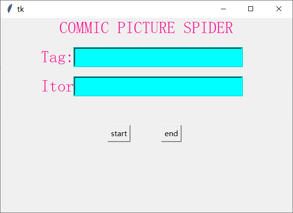
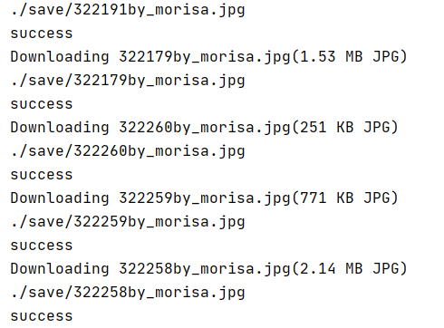
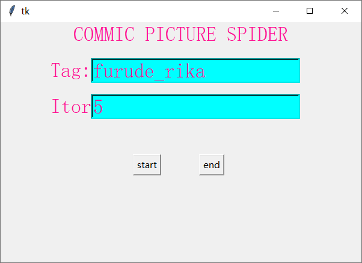
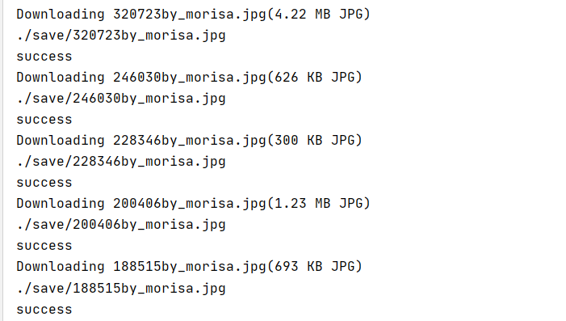

---
by morisa
Email morisa66@outlook.com
---

# 动漫壁纸自动爬取程序

## 爬取目标

> 目标URL：https://konachan.net/
>
> 通过网络爬虫，实现**自动化**的爬取该网站下的所有图片，并且支持**自定义tag**实现针对性的爬取。
>
> robots.txt：
>
> ~~~txt
> User-agent: *
> Disallow: /artist/update
> Disallow: /artist/destroy
> Disallow: /artist/create
> Disallow: /comment
> Disallow: /pool/create
> Disallow: /post/upload
> Disallow: /post/create
> Disallow: /post/delete
> Disallow: /post/update
> Disallow: /post/similar
> Disallow: /history
> Disallow: /note
> Disallow: /tag/edit
> Disallow: /tag/mass_edit
> Disallow: /wiki
> Disallow: /user
> Disallow: /post?tags=score:*
> Disallow: /post?tags=vote:*
> User-agent: HTTrack
> Disallow: /post
> ~~~

## 爬虫思路

> 1. 通过相关的爬虫库获取目标的HTML源代码。
> 2. 设置headers。
> 3. 通过正则表达式对网页进行过滤。
> 4. 加入一些辅助手段实现对某一个特定网页下的单张图片进行爬取，并将其封装为函数。
> 5. 获取网站主页 https://konachan.net/post 下的HTML源码，该HTML经过正则表达式过滤后，可以很容易获取到对应图片的网页。
> 6. 获取到网页后调用4中封装好的函数进行图片爬取与下载。
> 7. 利用tkinter库实现了简单的GUI界面，方便操作。

## 主界面介绍

> - `Tag`：可以设置想要爬取的图片的`tag`（这里的读音是罗马音），可以到[这里](https://konachan.net/tag?order=date)查看支持的`Tag`。该网站本身不支持模糊搜索，因此只能用`Tag`进行定位，不存在的`Tag`无法爬取到图片，但可以不设置Tag，默认爬取所有的图片。
> - `Itor`：即爬虫迭代的次数。如果不设置或者设置有误的话会被设置为1，即只爬取一个页面的图片，可以设置为10之类的整数，这样能爬取10个网页的图片。
> - 点击`start`会开启爬虫的线程，开始进行爬虫。
> - 点击`end`可以随时终止爬虫。
> - 爬虫得到的图片会默认下载保存到当前的相对路径`'./save/'`目录下，可以通过修改`save_path`参数来改变默认路径，该路径会由程序自动创建。
> - 按住`Ctrl+f` 可以定位到`Tag`的输入框，按住`Ctrl+g` 可以定位到`Itor`的输入框。

## 程序演示

> 不设置参数爬取的图片是`随机`的。（这里没有设置Itor只会爬取一个页面）
>
> 
>
> 
>
> `Terminal`会有简单的信息打印出来。
>
> 
>
> 当设置参数为`Tag=furude_rika`，`Itor=5`爬取的图片都有一个相同的角色furude_rika。
>
> 
>
> 
>
> `Terminal`会有简单的信息打印出来。
>
> 

# 备注

> 爬取到的图片放在`./save/`目录下。
>
> 打包命令如下：
>
> ~~~
> pyinstaller gui.py -p utils.py -p ComicGirlPictureSpider.py -D -w
> ~~~
>
> 程序源代码在`src`目录下。
>
> 本爬虫仅供个人学习练手使用，对被爬取网站无任何攻击行为。

